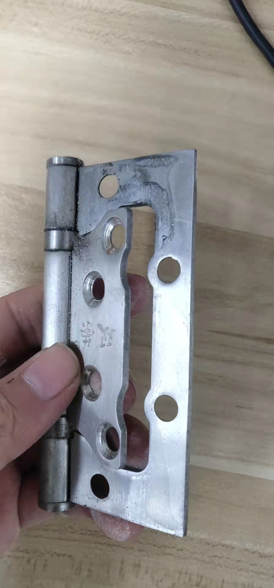
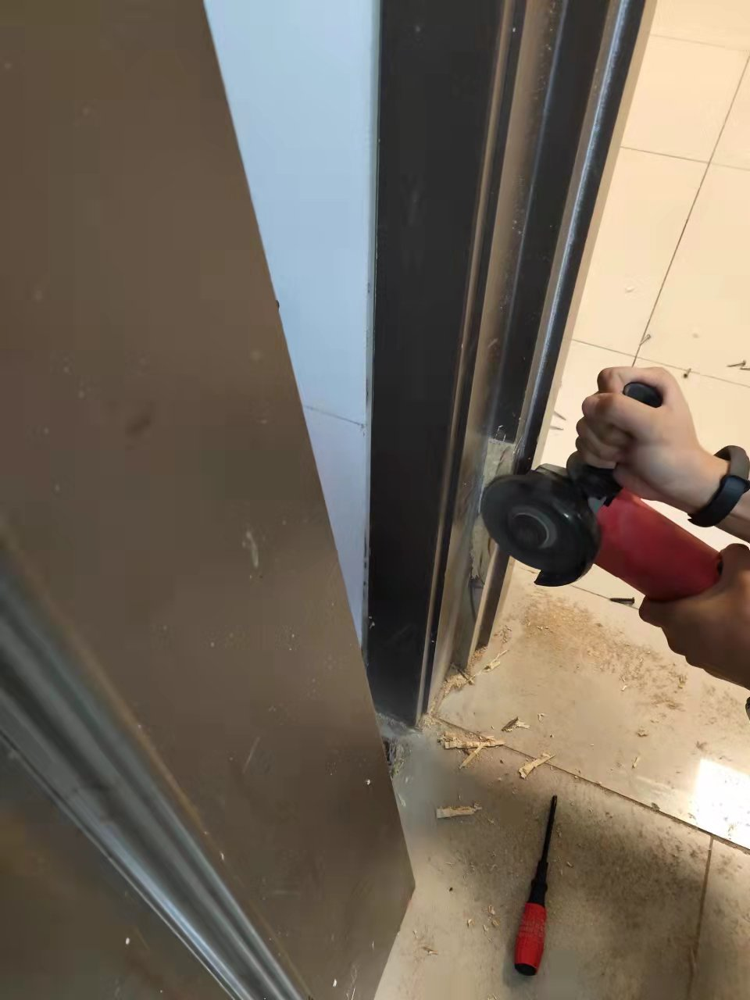
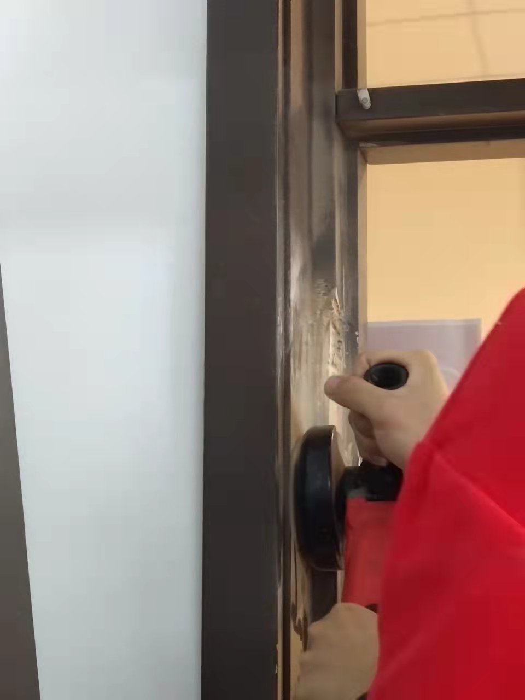
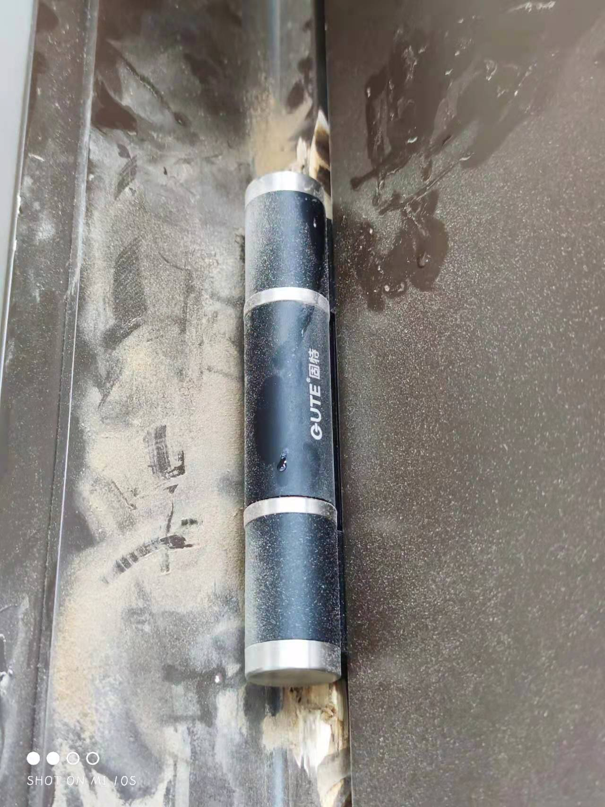
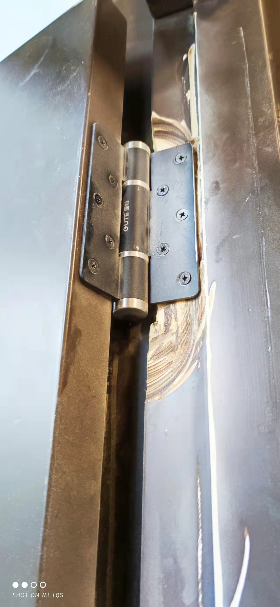
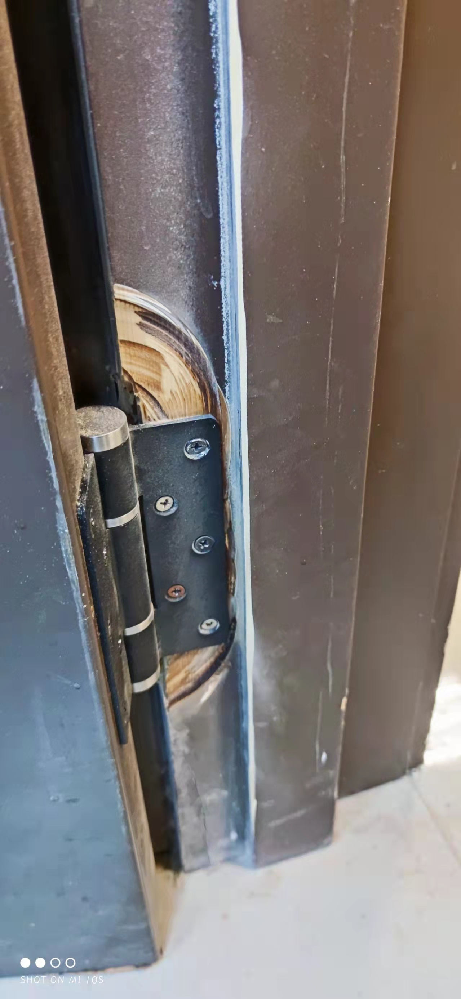

# Background 

记录2021年男生节

Wg理事长早在男生节之前几天就准备好了送给我们的男生节礼物——液压关门合叶，我知道这是送给我的，因为理事长肯定不会自己装。事实证明wggg从来不会让我失望。

早在2015年工场就试图装过闭门器，但是由于气窗和门之间的横梁较小，所以闭门器的尺寸要选取合适，由于当时几何量的错误估计，闭门器很快损坏，门上只留下他的残骸。

(下图中是拆除闭门器的梁，残骸已被移除)

到2021年冬天，由于人们难以建立随手关门的习惯，门口同学总是受到楼道冷空气的攻击，在此环境下提出了重新安装闭门器的需求。恰逢男生节，此项目成为良好的男生节团建项目。所谓团建，就是存在人，在干这个活。

# Preparations

最初使用了阵亡的闭门器的同款产品，wbc考虑需要计算几何尺寸，保证安装效果，rxgg嘲笑之，ylw遂随便买了一个。回来安装后遇到问题，关门角度一旦超过一个值，闭门器自锁

ylw同学就此问题提出了限制门的转角的方案，通过利用绳子在带摩擦的轴上张力随角度指数增大的性质设计了绳索闭门器，具体方案为：将绳子一端缠绕在闭门器轴上，一端缠绕在门把手上，由于此方法在限制门的转角的同时，使门不能完全闭合，不是一个很好的方案。

wg对此提出了新的方案：

*“不就是买一个合叶，多大点事儿啊！”   ——天空工场理事长 wg*

# Boys‘day

wggg在买合叶的时候再次忽略几何尺寸（或者没有慎重考虑），由于原合叶是采用重叠式，

故总厚度实际上只有一层的厚度，而新的合叶厚度是其两倍，故安装不上

## 正常安装

对于正常安装，其关键是合叶边线与门框边线平行，这一点通过合叶上的凹槽可以保证。实际上并不构成困难，wbc下午只用了不到1h就完成了此项工作，表示男生节并不快乐，所幸生活中的bug总是令人偷税。

## 非常规安装

由于合叶厚度的问题，我们尝试了很多办法，ylw同学通过分析对角线的轨迹提出了一些方法，这里的方法不重要，重要的是：

**门和榫卯加工有一个共同点：即在安装过程把他们看成厚度不可忽略的立方体，且要把对厚度的考虑放到第一位。**

通过这些操作，原来根本不可安装的门有了一定的安装可能，但是我们遇到了门框几何尺寸的限制，在这种情况下，ylw认为对门框的修改是必要且可行的

*“大不了换个门框嘛！”  ——ylw*

于是304在接下来的一小时变成了硝烟弥漫的战场：

在砂轮的尖叫声中，305xjj关上了门，304非战斗人员带上了耳机，300开会的同学停止零食，男生节的气氛被推至高潮。

## 安装经验

在本次安装过程中，以下内容值得总结：

1. 不要用电动螺丝刀拧有较大应力的螺丝，因为力会突变，存在一定的危险
2. 可以利用拧螺丝使产生的力矩来完成一些工作
3. 可以蹬墙来获得更大的力
4. 搬门这种重物的时候可以先抬起一角，做一个定点转动，然后放下，交替定点来使之前进，这样一个人就能完成搬运工作
5. 人的手不只能用来摸鱼，还可以干一些其他事情

# 安装结果

液压装置基本work，但是由于在砂轮改门框的时候没有保证摩擦面与原来面的平行，液压合叶的平衡角度不严格等于零，但是问题不大（work就行）

最后放一句和rxgg的对话：

*“你为什么不和他们一起出去玩啊？”      ——wbc*

*“因为我有更快乐的事——工场的网。”  ——wrx* 

