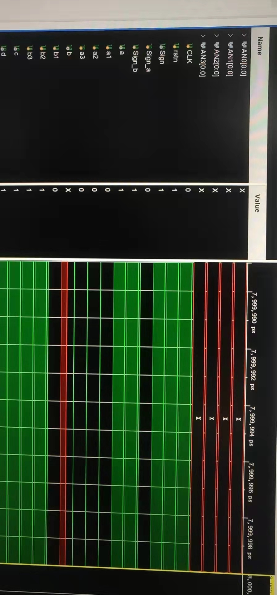
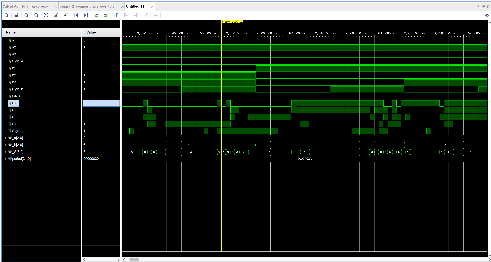
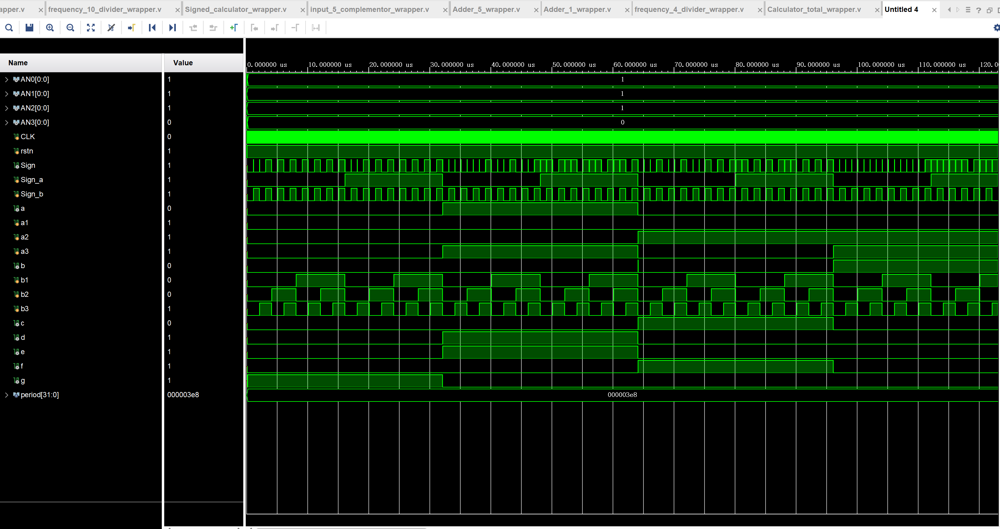

力9 魏冰川 2019011616 

Vivado实验报告

# Background

This term I'm playing FPGA, I begin with Xilinx Artix 7, Basys 3. In this process, many bugs are met and solved, contributing this blog.

Thanks for *Dram*, *Xuzhao Hou*'s help. 

# Vivado workflow

Vivado is a monstrous software comparing with programming IDE. Understanding its logic is important.

This video gives a basic introduction to vivado workflow: https://www.xilinx.com/content/xilinx/en/video/hardware/vivado-design-flows-overview.html

More information can be get from Xilinx Official Site.

## Project type

There are three project types in Vivado. Most commonly we use [RTL project](https://en.wikipedia.org/wiki/Register-transfer_level). which provides entries to block design. Another useful project type is I/O planning project. We can make our constraints file in an I/O planning project and then transfer these files to RTL project.

## Sources

Sources consists following  file types: 

1. Design sources: modules, block diagrams which will be synthesised will be put here(**Set as top to be synthesised**)
2. Constraints: files containing information for pin assignment with the extension .xdc.  Same constraints file can be  used for different projects, so it's better to keep them.
3. Simulation sources: files containing simulation information.（**Set as top will choose the simulation file to be run**), typically one simulation file for one module, module `A`'s sim file will be names `A_tb` (test bench).


Though verilog can be used both in design sources and simulation sources,  they use different rules in these two types of files. For example. if you write a  ring counter in verilog as this:

```verilog
module ring_ctr  #(parameter WIDTH=4)   
  (    
    input clk,                  
    input rstn,  
    output reg [WIDTH-1:0] out  
  );      
   
  always @ (posedge clk) begin  
      if (!rstn)  
         out <= 1;  
      else begin  
        out[WIDTH-1] <= out[0];  
        for (int i = 0; i < WIDTH-1; i=i+1) begin  
          out[i] <= out[i+1];  
        end  
      end  
  end  
endmodule  
```

This will work through simulation but not work through synthesis, since `for` loop is not supported in source file, so it's important to understand what can be used in different types of file.


## File structure

This document gives a very clear introduction to Vivado system level  design :

 https://www.xilinx.com/support/documentation/sw_manuals/xilinx2018_3/ug895-vivado-system-level-design-entry.pdf, (**I think it a very important document**)

For a typical project, it's directory goes like this:


- .xpr file stores the meta information for the project: search path...etc.
- .gen folder contains the generated output of IP cores
- .sim folder contains the simulation files, waveform flie .wdb, log files,etc.

Vivado sources files are organized by module, files contain the module will be included in parentheses. There are several ways that the sources are organized:

- Hierarchy:  this is organized by module, every module is a tree structure, modules construct the module will be easily found
- IP sources, this mode display all IP sources
- Libraries: this is also useful, it distinguishes modules constructed by block design and by verilog.
- Compile order: this will be determined automatically by Vivado so we don't need to pay much attention to it.


# Block design

For some reason, I began with block design under teachers' instructions. The first EDA homework is using block design to construct a four bit signed plus-minus calculator. I use 74 series IP core to build block diagram. However, this is not a conventional development method in real design. Typically, block design is used with a complex set of modules, rather than simple logic gates. However, the workflow with block design is still worth learning.

## Block design workflow

1. Add the IP core. In **Tools->>Settings->>IP->>Repository ** add repository 
2. Build block diagram. In **IP INTEGRATOR->>Create Block Design**, then draw diagram, finally add the port. (Pay attention to port type)
3. Generate output products **Right click the block file(.bd)->>Generate output products**
4. Create HDL wrapper. After create HDL wrapper, the block design will be seen as a module and be instantiated. **Right click the .bd file->>Create HDL wrapper ->>Choose automatic**
4. Package: After testing. **Tools->>Create and Package New IP->>Package a block design...**(Every packaged IP should be placed in an independent folder)


## Block design philosophy

Block design is used to construct the upper structure, every time you change the block design, you need to re-generate the output products, remake the HDL wrapper, and dispose of all modules containing this design. So don't use block design to do some lower designs(for example adder), since it's really painful to modify them frequently.

## Modify IP 

After modifying IP, all modules containing this IP should be upgraded. Typically, Vivado will warn you of the change of IP core, however, sometimes this may not work and cause painful bugs. So sometimes it's necessary to manually manipulate the folders. Use **Reports->Report IP status** to check the out-of-date IP cores or those can not be found, then manually upgrade them.

After modifying the IP core, I find it better to check to **IP sources**, then reset all generated outputs, then regenerate all output products.

Even now you may find it doesn't work at all! My method is to restart the Vivado and drink a cup of tea and then pray for it, and sometime later it will work. 

## IP use 

This document gives a comprehensive introduction to IP use: https://www.xilinx.com/support/documentation/sw_manuals/xilinx2016_1/ug995-vivado-ip-subsystems-tutorial.pdf

There are several points important for IP use:

### Ports

IP have different ports, for input and output, it is simple to use , the `inout` port is not that user-friendly, it may suggest a buffer error: solved:

https://support.xilinx.com/s/question/0D52E00006hpXyaSAE/why-wont-vivado-automatically-create-needed-buffer-when-using-inout-bidirectional-port?language=en_US

Another important port is bus. A bus port can transfer more than one bit of data, Bus port should be best linked to bus port, however, if you neglect to design the compatible IP with bus interface, you can also use Slice IP to divide the bus signal.

###  Constant input

We often need to constrain the IP port to a constant value, there are two ways to implement this:

1. **Tie-off**, in Package IP window, there is a setting menu for port, the tie-off value will be regarded as the value the port is if not connected
2. **Constant IP**, a constant IP provides a bus interface.

## Add verilog Module to Block design

In block design Diagrams, **Right-click->add Modules**, choose the verilog module.

# Simulation

Verilog simulation consists of behavioral simulation, post-synthesis and post-implementation synthesis. In vivado, behaviroal simulation also consists of propagation delay. This can be eliminated by changing property of the module, but I consider it's not necessary. 

## Simulation sources 

Testbench references: https://verilogguide.readthedocs.io/en/latest/verilog/testbench.html

There are some tricks for testbench writing:

```verilog
#1 // # means delay
// for a module with 4 inputs, we often need to tranverse them in testbench
initial begin
  for(integer i=0;i <16 ; i=i+1) begin //attention int may not work here
    {a,b,c,d} = i; //{a,b,c,d} with concatenate input variables
  end
end
//If testbench has CLK, CLK can be written in:
 always #10 CLK = ~CLK; // put this out of inital
//or 
initial begin
    CLK = 0;
    forever #10 CLK = ~CLK;
end
//inital and for can be replaced by always
always @(posedge CLK)
begin  
    counter <= counter + 28'd1;
    if(counter>=(DIVISION -1))
        counter <= 28'd0;
     clock_out <= (counter < DIVISION  /2)?1'b1:1'b0;
end
```

## Simulation results display

The most common way is to read the waveform and to check the functionality, however, this is neither graceful nor accurate, so some tricks are needed:

```verilog
//By concatenating the variables, it's eaiser to check the results 
reg [3:0] _a = {a3,a2,a1,a0}; // Pay attention to the order
//Display the exceptions or special circumstances 
if(a3 != 1)
    $display ("Simulation error!") 
```

If a signal is red "X", then the signal is not defined, this is especially common in a sequential logic circuit.

If a signal is blue "Z", then the signal is not connected to the module, you should check the testbench.

## Simulation initial condition

In my simulations, results for the first several cycles may be red "X", this is because the signal is not properly initialized. 



This can be solved by adding a reset port the module and set a proper initial state:

```verilog
initial begin
      {CLK,rstn} <= 0;
      repeat(2) @(posedge CLK)
      rstn <= 1;
end
```

## Simulation parameters

The most important parameters is simulation timestep, theoretically, the simulation timestep should be greater than its propagation delay, however. for better display effect, a longer timestep should be taken.

 Besides changing simulation timestep, we can also change the signal lasting time, of course we cannot dispose a lasting time shorter than t setup or t hold.

When simulation parameters is not set up properly, the Competition risk will be especially apparent as below: 



Here(the yellow line), input +2 plus input -6, we get wrong answer -8, we can see around the yellow line, the results `_S` changes rapidly(ns level) through `9-8-9-6-2-0` and finally settle down to the right answer -4, by definition we know that the circuit has 
$$
t_{pd} \approx 35ns\\
t_{cd} \approx 15ns
$$
In our simulation, the effect of Competition risk  should be recognized or else it will lead us to thick our design is wrong. For a system like this, where output S1-S4 are used to display rather than used as input to flip-flop, Competition risk doesn't matter so much, but in other circumstances, this should be considered seriously.

For a system with significant frequency differences, it's better to simulate for different parts, or to simulate for different parts. or else you will get :



In above picture(TOP Post-Synthesis Timing simulation), CLK signal is actually useless.


# Verilog fundamentals

Verilog can be use d to write the sources(both design and simulation), here is a good verilog tutorial: 

https://www.chipverify.com/verilog/verilog-tutorial


# I/O Planning

There are two typical way for I/O planning:

1. New I/O planning project. In this methoed, we create an I/O planning project and assign pins, then we transfer this I/O planning project to a RTL project, which will give us a .xdc file
2. Post-synthesis I/O planning: After synthesis, we change to synthesis or implementation design, then we change layout by **Layout->I/O Planning**, in **Package** tab we can see pin resources, FPGA pin resources are organized in a form called **bank**, for more information, see this blog: https://www.edaboard.com/threads/what-is-a-bank-in-fpga.78952/

# Clock system

FPGA clock system is a little more complicated than MCU, see

https://hardwarebee.com/ultimate-guide-fpga-clock/

for Basys3, pin W5 gives a 100MHz clock, so just use it and feel happy

# Programming the board

Program the board is the most exciting part of the project, after generating the bitstream, open Hardware manager, then choose **auto-connect**. If Vivado connect nothing but the localhost, you should check your PC-board connection.


# Debug and some conventions

To reduce the possibility of making error, I conform to some conventions:

1. Write one single simulation file for each module, and name the file for `module1` as `module1_t`
2. Create a folder for my self-defined IP
3. Input(from MSE to LSE): a3a2a1,b3b2b1 Output(from MSE to LSE): S3S2S1 

When designing a module, we should first introduce some redundant pins to help us debug, and delete these pins when functionality is ensured.

For example when we want to check the functionality of a 5-bit full adder, I can export a port for each carry bit and see whether it is right, if we get the right final solution , we delete these redundant ports and package it.

For error `can not find module xxx`, re-generate all output products and remake HDL wrapper will always do the job.

For error `can not fine port xxx`, check the tb file and the module.

**Window->Project Summary** will give a total description of project and is really useful to see how many bugs you've got now.


# Issues

1. Xilinx 74LS48' LT port is not actually working. It may work in he simulation, but will not work in implementation.
1. Asynchronous input in our sequential simulation will cause some warnings, but this will not cause some bad results, so I just neglect it.

# Some classical design

Ring counter: https://www.javatpoint.com/verilog-ring-counter


# 4x4 matrix Keyboard

Keyboard debouncer and scanner is hard to combine, so scan slowly.

If there is a key ready, stop scanning.


# Breadboard prototype

Before making more parts, make sure made parts work properly. 

Connect pins to button to test their function.


# EDA 2

1. Do not write asynchronous logic, always transfer to state equation.

2. LED unstable -> floating pin

3. Multiple clock domain

   How to write a state machine: 

1. trigger mode： edge trigger, positive edge detector

   ​							latch : [never use latch](https://www.nandland.com/articles/how-to-avoid-transparent-latches-in-vhdl-and-verlog.html#:~:text=It%20was%20stated%20that%20latches,never%20be%20used%20is%20twofold%3A&text=They%20can%20be%20very%20difficult,to%20fail%20to%20meet%20timing)

